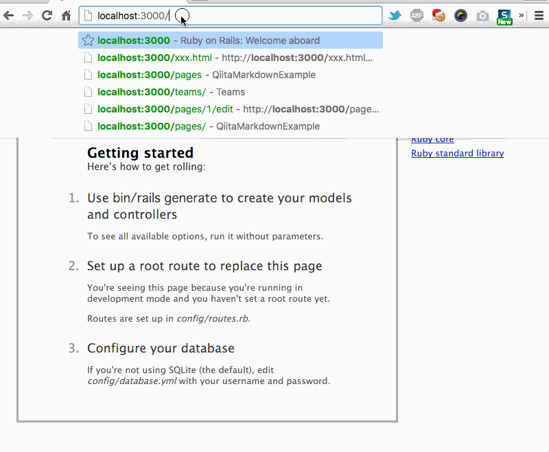

See
- Ruby on Rails で Qiita::Markdown を使えるようにするまで [http://qiita.com/5t111111/items/55ad30a85372ec6febf5](http://qiita.com/5t111111/items/55ad30a85372ec6febf5)

- RubyプログラムにJavascriptを埋め込みたい [https://teratail.com/questions/23695](https://teratail.com/questions/23695)

- 
